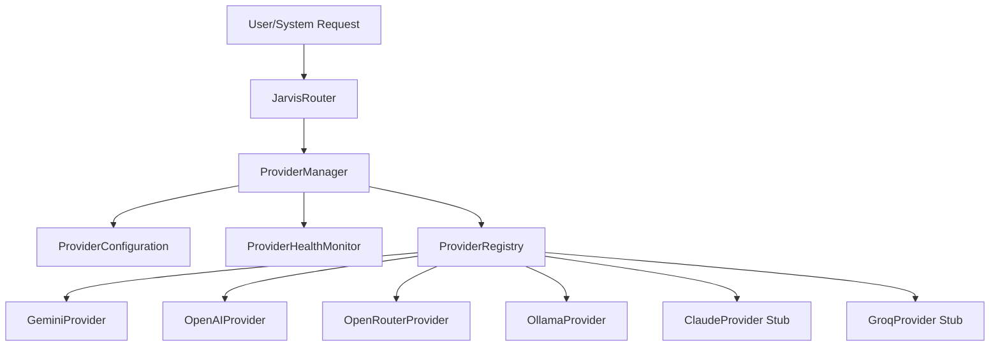

# J.A.R.V.I.S. AI Provider Abstraction Layer

This document describes the design, configuration, and integration of the unified **AI Provider Abstraction Layer** introduced in Sprint 8.5.

## Overview
J.A.R.V.I.S. integrates with multiple AI providers (Google Gemini, OpenAI, OpenRouter, and local Ollama) through a centralized, robust API layer. Instead of instantiating provider SDKs directly in individual modules, all conversational, planning, vision, and embedding tasks are routed through the central `ProviderManager`.



---

## Core Components

### 1. `BaseProvider` (`core/providers/base.py`)
An abstract base interface outlining required lifecycle and capability contracts:
- `initialize(config)`: Setup API clients lazily.
- `is_available()`: Health check capability readiness.
- `chat(...)`: Multi-turn message execution with tool bindings.
- `vision(...)`: Analyze screenshots and visual files.
- `embeddings(...)`: Vectorize query tokens.
- `list_models()`: Query provider models list.
- `health_check()` / `shutdown()`: Maintain operational states.

### 2. `ProviderResponse` (`core/providers/base.py`)
A standardized response data-structure returned by all AI actions:
- `content`: Text response payload.
- `tool_calls`: Formatted list of tool calls in OpenAI format.
- `model`: Exact model ID resolved.
- `input_tokens` / `output_tokens`: Usage metrics.
- `cost`: Cost calculation estimate.
- `latency`: Total network/computation response time.

### 3. `ProviderManager` (`core/providers/manager.py`)
Orchestrates high-level routines:
- **Routing**: Determines primary provider & model configurations by task types (e.g. `coding`, `vision`, `simple_conversation`, `reasoning`).
- **Fallbacks**: When a request fails, automatically cascades through the fallback queue until completion or graceful exit.
- **Metrics**: Persists performance stats to SQLite database table `provider_metrics`.

### 4. `ProviderConfiguration` (`core/providers/config.py`)
Manages configuration options loaded from `core/providers_config.json` and environmental variables. Automatically masks secrets to prevent key leaks.

### 5. `ProviderHealthMonitor` (`core/providers/health.py`)
Maintains sliding-window diagnostic metrics (success rate, average latency) for active provider services.

---

## Fallback Routing Policy
When executing a request, `ProviderManager` constructs a priority queue:
1. **Primary Provider** (the routed choice for the task type)
2. **Fallback Chain** (configured in order of fallback priority)

If the primary provider is unconfigured, rate-limited, or times out, the manager automatically catches the exception, registers a failure in the health monitor, and transparently attempts execution on the next prioritized provider.

Default chain priority: `openrouter` $\rightarrow$ `gemini` $\rightarrow$ `openai` $\rightarrow$ `ollama`

---

## Developer Usage

### Conversational Chat
```python
from core.providers import provider_manager

messages = [
    {"role": "system", "content": "You are J.A.R.V.I.S."},
    {"role": "user", "content": "Hello! Help me write a script."}
]

response = provider_manager.chat(
    messages=messages,
    task_type="coding",       # Automatically resolves the best model
    temperature=0.7
)

print(response.content)
print(f"Latency: {response.latency}s, Cost: ${response.cost}")
```

### Vision Analysis
```python
from core.providers import provider_manager

response = provider_manager.vision(
    image_data="path/to/screenshot.png",
    prompt="What applications are currently open?"
)
print(response.content)
```
