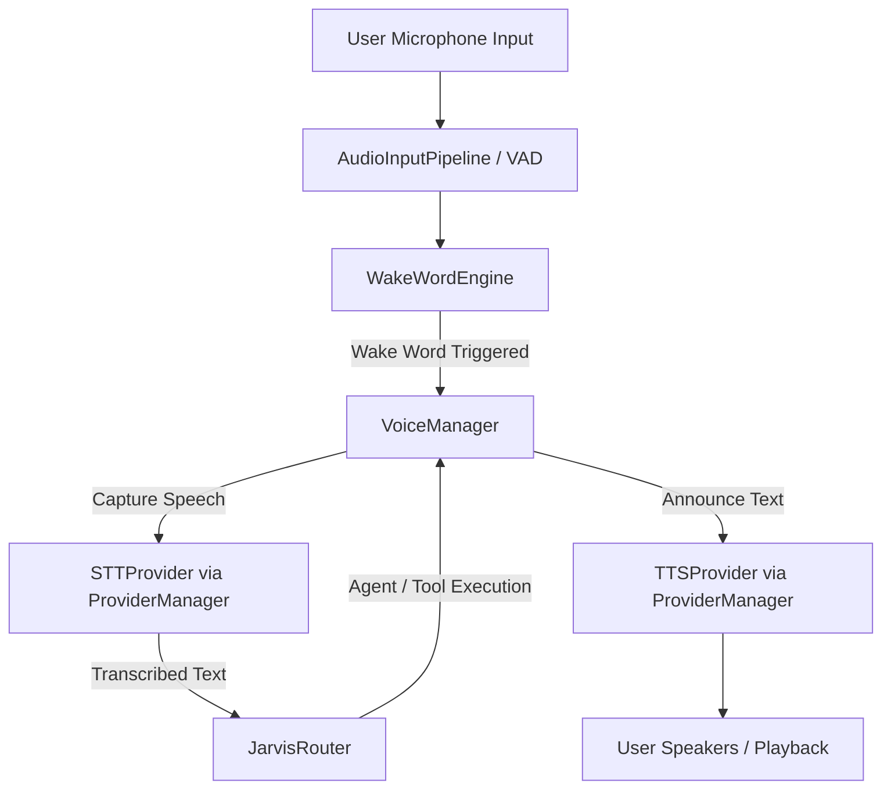

# J.A.R.V.I.S. OS — Voice Intelligence Layer

This document details the architecture, configuration, provider expansion, and troubleshooting guides for the Voice Intelligence Layer introduced in Sprint 9.

---

## 1. System Architecture

The Voice Intelligence Layer is a parallel Input/Output interface to the existing J.A.R.V.I.S. Core Router, Planner, and Tool Framework.



### Components List
* **`AudioInputPipeline` (`voice/input.py`)**: Captures raw 16kHz mono audio streams via `sounddevice`. Includes high-pass centering filters and RMS-based voice activity detection (VAD).
* **`WakeWordEngine` (`voice/wakeword.py`)**: Listens continuously, transcribing small audio segments to match configured wake word patterns.
* **`VoiceConversationManager` (`voice/conversation.py`)**: Manages conversational states (`IDLE`, `LISTENING`, `PROCESSING`, `SPEAKING`), idle timeouts, and follows up window triggers.
* **`VoiceManager` (`voice/manager.py`)**: The central coordinator managing microphone capture loops, routing spoken confirmation approvals, and handling live user interruptions.
* **`providers.py` (`voice/providers.py`)**: Wraps concrete Speech-to-Text and Text-to-Speech engines.
* **`output.py` (`voice/output.py`)**: Safe player thread wrapper supporting immediate playback cancellations.

---

## 2. Configuration Settings

All parameters can be configured declaratively via `.env` or `voice/voice_config.json`:

```json
{
  "preferred_stt": "local",
  "preferred_tts": "edge-tts",
  "wake_words": ["jarvis", "hey jarvis"],
  "language": "en-US",
  "speed": 1.0,
  "voice_model": "en-GB-RyanNeural",
  "volume_threshold": 0.02,
  "silence_duration_seconds": 1.5
}
```

### Environmental Variables
- `PREFERRED_STT`: STT provider identifier (`local`, `openai`, `faster-whisper`, `whisper-cpp`).
- `PREFERRED_TTS`: TTS provider identifier (`edge-tts`, `openai`, `elevenlabs`, `piper`, `coqui`).
- `VOICE_LANGUAGE`: Default locale code (e.g. `en-GB`, `en-US`).
- `VOICE_SPEED`: Rate multiplier (`1.0`).
- `VOICE_MODEL`: Model ID or neural voice identifier (e.g. `alloy`, `en-GB-RyanNeural`).
- `VOICE_VOLUME_THRESHOLD`: RMS noise threshold for VAD (default `0.02`).
- `VOICE_SILENCE_DURATION`: Duration of trailing silence in seconds indicating speaking has ended (default `1.5`s).

---

## 3. Spoken Confirmation Security Integration

When a task triggers a **MEDIUM**, **HIGH**, or **CRITICAL** risk execution, the Permission Engine halts the Planner and raises a `ConfirmationRequiredError`.

The Voice Layer intercepts this block:
1. J.A.R.V.I.S. announces: *"This action requires confirmation, sir. Please confirm by saying yes or no."*
2. The microphone starts a confirmation listening window (10 seconds).
3. If the user says:
   - **"Yes" / "Confirm" / "Approve"**: The manager automatically authorizes the task, generates a security token, and calls the router to resume the workflow.
   - **"No" / "Cancel" / "Abort"**: The manager aborts the workflow safely.

Voice commands never bypass J.A.R.V.I.S.'s security protocols.

---

## 4. Expanding Providers

### Adding a Speech-to-Text Provider
1. Open `voice/providers.py`.
2. Declare a class inheriting from `BaseSTTProvider`:
   ```python
   class CustomSTTProvider(BaseSTTProvider):
       def initialize(self, config: Dict[str, Any]) -> None:
           pass
       def is_available(self) -> bool:
           return True
       def transcribe(self, audio_data: Any) -> str:
           return "Transcribed text"
       def shutdown(self) -> None:
           pass
   ```
3. Register the class instance in the `_stt_providers` factory mapping at the bottom of `voice/providers.py`.

### Adding a Text-to-Speech Provider
1. Open `voice/providers.py`.
2. Declare a class inheriting from `BaseTTSProvider`:
   ```python
   class CustomTTSProvider(BaseTTSProvider):
       def initialize(self, config: Dict[str, Any]) -> None:
           pass
       def is_available(self) -> bool:
           return True
       def speak(self, text: str) -> None:
           # Save to temp path and play via voice.output.play_audio_file
           pass
       def stop(self) -> None:
           audio_out.stop_playback()
       def shutdown(self) -> None:
           self.stop()
   ```
3. Register the class instance in the `_tts_providers` factory mapping at the bottom of `voice/providers.py`.

---

## 5. Troubleshooting

### 1. Microphone Not Detected / `sounddevice` Errors
- Verify that your recording devices are enabled in Windows Sound Control Panel.
- Run a quick test script to list available devices:
  ```python
  import sounddevice as sd
  print(sd.query_devices())
  ```
- Ensure you have configured the correct recording sample rate (default `16000`Hz).

### 2. Audio Playback Issues
- Ensure `playsound` or `sounddevice` are available. If not, the system will automatically fall back to native Windows PowerShell MediaPlayer / SoundPlayer commands.
- Ensure audio volume is turned up on the host operating system.

### 3. High Latency in Transcription
- If using `local` STT, make sure you have a stable internet connection (queries Google's free Web Speech API).
- Switch to local providers like `faster-whisper` or self-hosted models for offline deployments.
