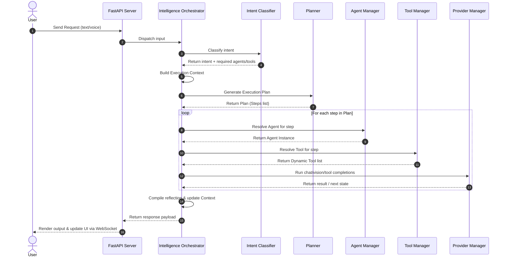

# Sprint 10 — Intelligence Core & Orchestrator Architecture Blueprint

This document details the architectural layout, flowcharts, schemas, and specifications for Phase 2, Sprint 10. The goal of this blueprint is to transition J.A.R.V.I.S. from a direct request-response assistant into an orchestrated, planning-driven AI Operating System.

---

## 1. Current Architecture Analysis

### Current Execution Flow
Currently, requests originating from the HTTP or WebSocket endpoints (`server.py`) interface directly with the `JarvisRouter`. The routing flow operates as follows:
1. The user query is captured by `server.py` and passed to `JarvisRouter.process_input()`.
2. `JarvisRouter` parses the intent using a simple heuristic/LLM prompt to choose whether the query requires a single response or a multi-step workflow.
3. If it's a multi-step request, the `JarvisRouter` invokes the `Planner` to decompose the goal into sequential tasks.
4. The `Planner` runs the tasks, calling tools directly from the `ToolRegistry` and checking execution states.
5. If it's a conversation turn, the `JarvisRouter` calls `UnifiedBrain` or `ProviderManager` directly.
6. The final response is returned to the frontend.

```
Frontend / Client
      │
      ▼
 FastAPI Server (server.py)
      │
      ▼
 JarvisRouter (core/router.py)
   ├──► UnifiedBrain (core/brain.py) ──► ProviderManager
   └──► Planner (core/planner.py) ─────► ToolRegistry & Providers
```

---

## 2. Problems Identified in the Current Setup
1. **Ad-Hoc Routing**: Intent classification is coupled inside the `JarvisRouter`, making it difficult to expand or subclass.
2. **Coupled Execution Paths**: The `Planner` directly invokes tools and manages agent contexts. There is no separation between plan generation and plan execution.
3. **Bypassing Core Controllers**: System plugins, chat interactions, and agent sessions call providers directly via `UnifiedBrain` or `ProviderManager` instead of utilizing a single orchestrated pipeline.
4. **Weak Context Lifecycle**: Thread-local context variables exist but lack a unified, serializable data model that can easily persist, pause, cancel, and resume across client requests.
5. **No Reflection Layer**: There is no post-execution diagnostic loop that evaluates tool/provider performance to compile metrics.

---

## 3. Proposed Architecture

We propose introducing a centralized **Intelligence Orchestrator** as the permanent execution backbone of J.A.R.V.I.S. All inputs—whether text, voice, or tool-generated follow-up loops—are routed through this core.

```
                     User / Client
                           │
                           ▼
                     FastAPI Server
                           │
                           ▼
                    Intent Classifier
                           │
                           ▼
                Intelligence Orchestrator ◄──► Execution Context
                           │
             ┌─────────────┼─────────────┐
             ▼             ▼             ▼
          Planner    Memory Engine  Agent Manager
             │                           │
             ▼                           ▼
       Execution Engine             Tool Manager
             │                           │
             └─────────────┬─────────────┘
                           ▼
                    Provider Manager
```

### Component Breakdown
1. **`Intent Classifier`**: Extensible parser mapping queries to specific intents and listing the required agents/tools needed.
2. **`Intelligence Orchestrator`**: The orchestrating pipeline manager. Builds context, loads memory, triggers planning, invokes agents, executes tools, handles recovery, and returns responses.
3. **`Planner`**: Decomposes complex goals into multi-step DAG (Directed Acyclic Graph) structured execution plans supporting sequential/conditional steps.
4. **`Agent Manager`**: Centrally coordinates agent models (Conversation, Coding, Researcher, Browser, Voice, Automation, Memory).
5. **`Tool Manager`**: Exposes context-filtered tools dynamically, wrapping execution limits and handling failures.
6. **`Reflection Engine`**: Compiles metrics and results post-execution into structured summaries.

---

## 4. Sequence Diagram



---

## 5. Folder Structure & New Modules

To implement this without breaking existing functionality, we introduce a new folder structure under `core/orchestrator/`:

```
e:/J.A.R.V.I.S/
├── core/
│   ├── orchestrator/
│   │   ├── __init__.py
│   │   ├── manager.py         # IntelligenceOrchestrator class
│   │   ├── classifier.py      # IntentClassifier & classification schemas
│   │   ├── context.py         # ExecutionContext model
│   │   ├── tools.py           # ToolManager class
│   │   └── reflection.py      # ReflectionEngine class
│   ├── agents/
│   │   ├── __init__.py
│   │   └── manager.py         # AgentManager & AgentRegistry
│   ├── router.py              # JarvisRouter (refactored to route to Orch)
│   └── planner.py             # Planner (adapted to run via Orch)
```

---

## 6. Public Interfaces & Data Models

### Data Models
```python
# core/orchestrator/context.py
from pydantic import BaseModel
from typing import Dict, Any, List, Optional

class ExecutionStep(BaseModel):
    id: str
    description: str
    assigned_agent: str
    assigned_tool: str
    args: Dict[str, Any]
    status: str  # PENDING, RUNNING, COMPLETED, FAILED
    result: Optional[str] = None
    error: Optional[str] = None

class ExecutionContext(BaseModel):
    session_id: str
    goal: str
    intent: str
    confidence_score: float
    plan: List[ExecutionStep] = []
    current_step_idx: int = 0
    active_agent: str = "None"
    active_provider: str = "None"
    retry_count: int = 0
    status: str = "PENDING"
    memory_references: List[str] = []
    errors: List[str] = []
```

### Public Interfaces
```python
# core/orchestrator/classifier.py
class IntentClassifier:
    def classify(self, query: str) -> Dict[str, Any]:
        """
        Returns: {
            "intent": "Coding",
            "confidence": 0.95,
            "required_agents": ["CodingAgent"],
            "required_tools": ["create_file", "write_file"]
        }
        """
        pass

# core/orchestrator/manager.py
class IntelligenceOrchestrator:
    def execute(self, query: str, session_id: str) -> Dict[str, Any]:
        """Runs the entire pipeline using ExecutionContext."""
        pass
```

---

## 7. Lifecycles & Error Handling

### Request Lifecycle
1. **Intake**: Request parsed and session context retrieved.
2. **Analysis**: Intent classifier runs. If confidence is low, falls back to `Conversation` intent.
3. **Planning**: If intent requires tools/file management, Planner builds steps. Single chat intent skips planning.
4. **Execution**: Orchestrator step-loops. Updates pushed to frontend over WebSockets.
5. **Reflection**: Post-run summary compiled and stored in SQLite metrics.

### Error Handling Strategy
* **Step Failure**: If a step fails, the orchestrator triggers a retry up to the configured limit. If failure persists, it checks if a conditional alternate step is registered.
* **Emergency Stop**: If a step raises a permission/critical failure, the context status is set to `FAILED`. It announces the failure and stops.
* **Resume Capability**: A failed context can be resumed using follow-up text `"resume"` or `"continue"`, picking up from the last failed index.

---

## 8. Provider & Memory Interaction
* **Memory Retrieval**: Before plan generation, user facts and previous session inputs are fetched from SQLite to inject context.
* **Memory Storage**: Post-run, the reflection output is logged to the `provider_metrics` database and new facts are saved to the memory bank.
* **Provider Routing**: All model completion calls use `ProviderManager`, respecting fallback priorities without direct library calls.

---

## 9. Future Scalability Considerations
* **Sub-Orchestration**: The architecture allows spawning child orchestrators for sub-goals.
* **Pluggable Agents**: Adding a new agent only requires registering it in `AgentManager`. No modification of the main orchestrator code is needed.
